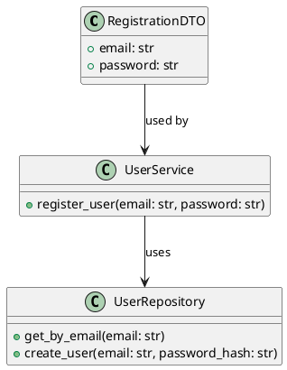
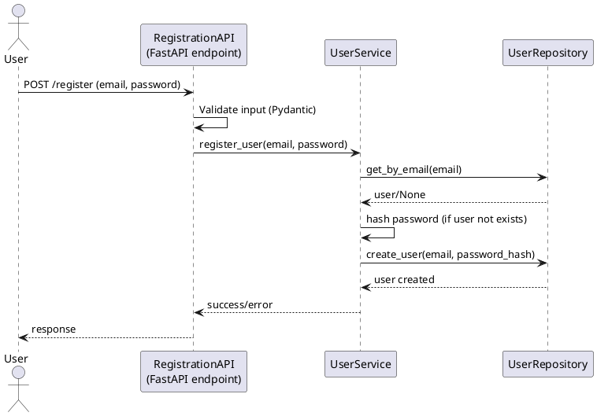

# User Registration Low-Level Design

## 1. Class Diagram (PlantUML)

---

## 2. Sequence Diagram (PlantUML)

---

## 3. Design Notes
- Input validation is handled by Pydantic models.
- Business logic (uniqueness, password policy, hashing) is in `UserService`.
- Database access is abstracted in `UserRepository`.
- API endpoint orchestrates the flow and returns appropriate responses.
